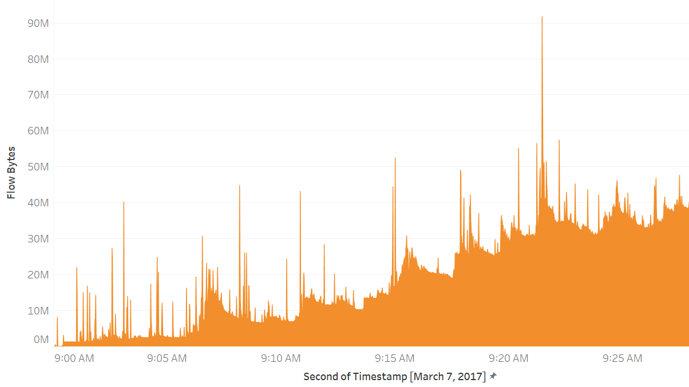
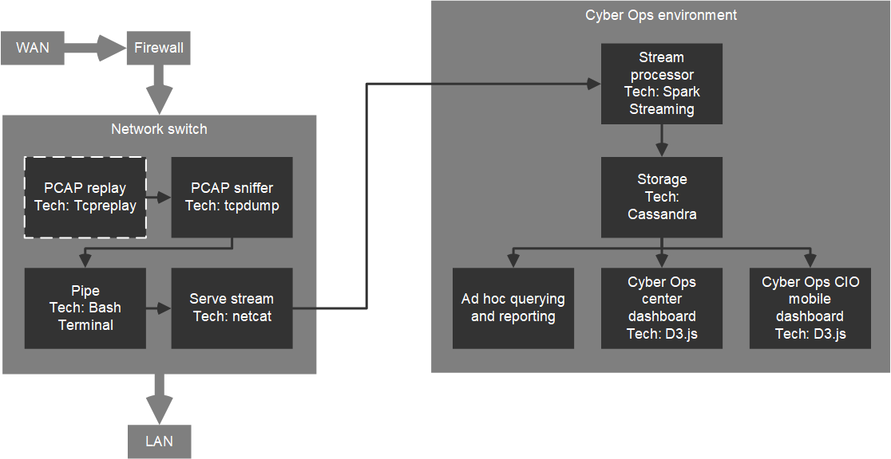
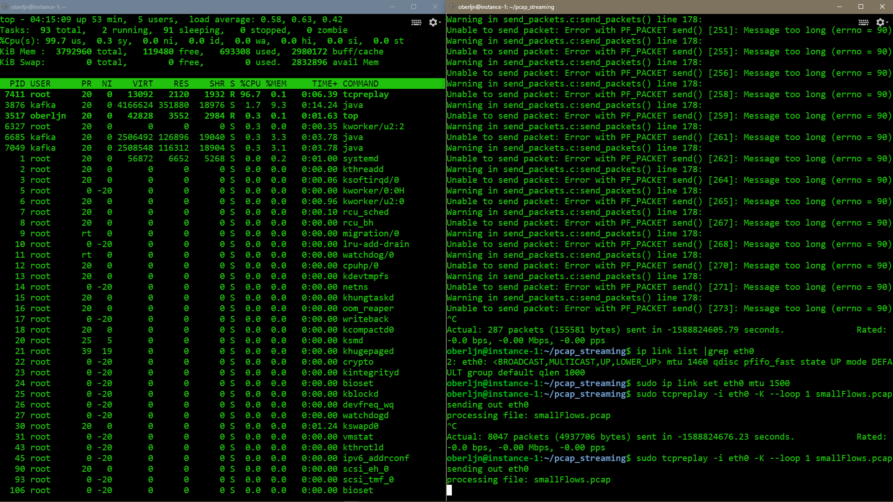
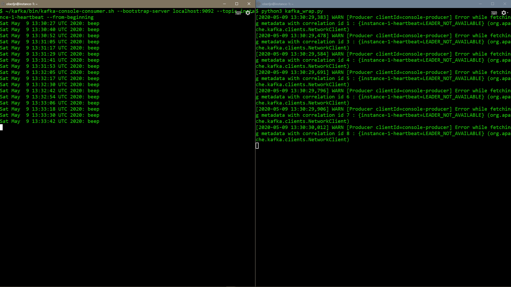
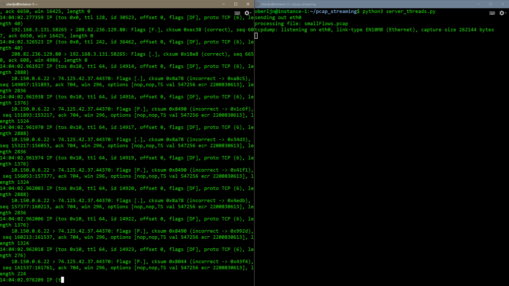
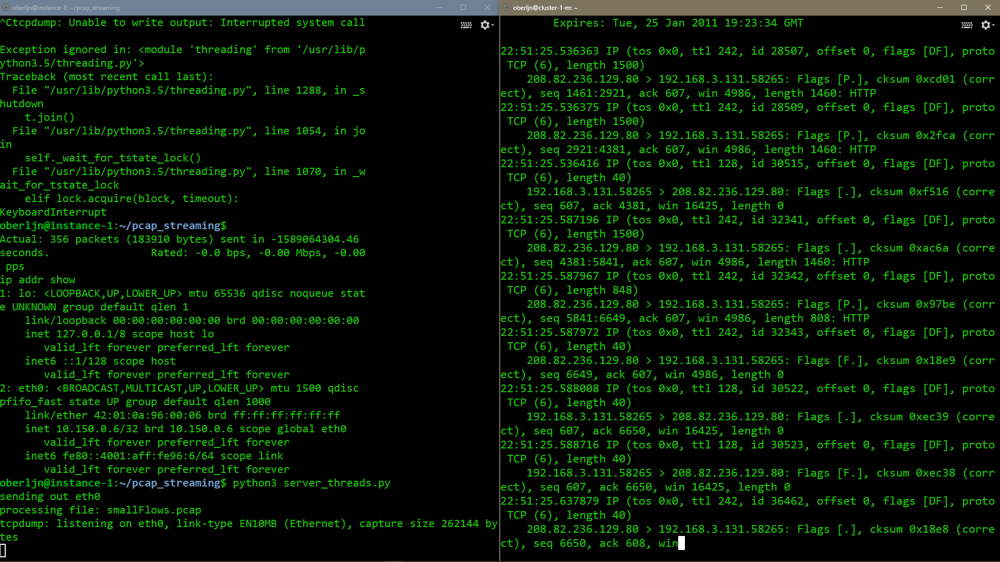
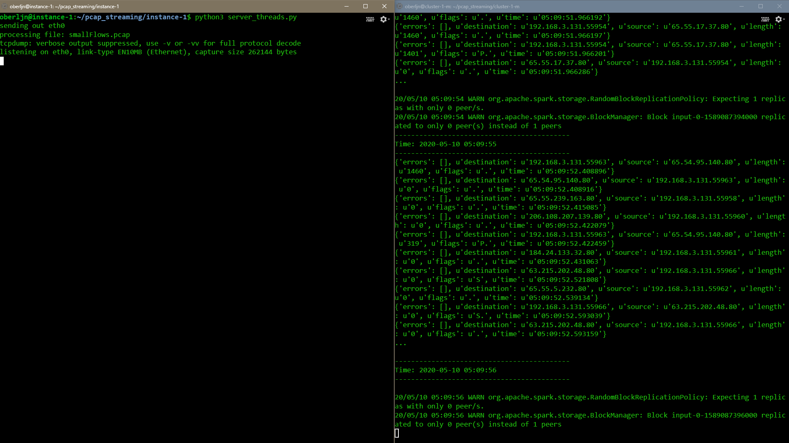

# PCAP stream processing
John Oberlin

Submission for DATA 603 Platforms for Big Data Processing, University of Maryland Baltimore County

In [this directory](./), one will find directories for the servers instance-1 and cluster-1-m,
holding the essential programs to run the project, as well as an appendix directory
that holds supplemental information, code, and visuals mentioned within this document.
This document is written in Markdown and is best viewed in Chrome with the [Markdown Viewer](https://chrome.google.com/webstore/detail/markdown-viewer/ckkdlimhmcjmikdlpkmbgfkaikojcbjk)
extension installed. Otherwise, see the PDF of the same name.

## Overview
This project is a proof of concept of real-time parsing and storage of enterprise network traffic.
Processing network traffic flow is an unstructured data problem,
in which 10's or 100's of megabytes could be easily passing a sensor per second (Figure 1).
Exploring such technical infrastructure is important
for real-time machine learning applications for detecting cyber exploits.
However, PCAP is only one data source mong several streaming sources
that can enrich cyber operations analyses.
A full implementation would include data streams via Kafka topics from sources such as log files and help desk tickets.


**Figure 1**:
*Packet bytes per second from an analysis of the CICDataset's Labelled Flows
(Sharafaldin, Lashkari, and Ghorbani, 2018).
The analysis calculated the average bytes per second of the full volume of the flow
via the timestamp, flow duration, and flow bytes per second features in
the flow-level traffic report. See [Monday-WorkingHours.pcap_ISCX_sample.csv](appendix/Monday-WorkingHours.pcap_ISCX_sample.csv),
which was downloaded from [205.174.165.80/CICDataset/CIC-IDS-2017/Dataset/](http://205.174.165.80/CICDataset/CIC-IDS-2017/Dataset/)
(GeneratedLabelledFlows.zip).*

The datasets used in this project are PCAP files of capture data of generated network activity.
[The Intrusion Detection Evaluation Dataset](https://www.unb.ca/cic/datasets/ids-2017.html) (CICIDS2017)
is hosted by the University of New Brunswick: Canadian Institute for Cybersecurity.
The dataset consists of full packet payloads in pcap format,
along with labeled network flows and extracted datasets for machine learning
(sets of packet exchanges between hosts).
However, for this particular project, the interest is in the original raw packet
activity within the passage of time.
The set has a full week's worth of traffic. One day is labeled as benign,
and other days include cyber attacks.
Two of the files, a benign day and a DDoS attack day was downloaded to instance-1, the simulated switch server with the ```wget``` command.

```
[{  "file": "Monday-WorkingHours.pcap",
    "url": "http://205.174.165.80/CICDataset/CIC-IDS-2017/Dataset/PCAPs/Monday-WorkingHours.pcap",
    "GB": "10",
    "exploit": "benign"},
{   "file": "Wednesday-WorkingHours.pcap",
    "url": "http://205.174.165.80/CICDataset/CIC-IDS-2017/Dataset/PCAPs/Wednesday-WorkingHours.pcap",
    "GB": "12",
    "exploit": "DDoS attack"}]
```

## Architecture overview
Without access to an enterprise network switch, this project simulates the traffic
by replaying the CICDataset on a cloud server, which listens to the traffic
and sends unstructured packet lines to a Spark cluster for processing.
The master node then stores the lines transformed as key-value pairs (Figure 2).


**Figure 2**

## Network switch
The simulated network switch, named instance-1, replays the PCAP files with the command line tool tcpreplay.
"The basic operation of tcpreplay is to resend all packets from
the input file(s) at the speed at which they were recorded,
or a specified data rate, up to as fast as the hardware is capable" (tcpreplay man page, Debian).
Another common networking tool, tcpdump captures the replayed packets.
(Note that the tool also captures actual instance-1 SSH session traffic, which could be filtered out.)
The standard output is piped to yet another networking tool, netcat.
Netcat serves the data on a specified port for consumption of the Spark cluster.
It may be noted that netcat is a quick solution and that a queing or messaging service
ought to be implemented. A service like Kafka provides scalability and high-availability
message queues on clusters, with a level of security.
The following configuration includes the installation of Kafka on isntance-1;
however it is not implemented in the current project version.

### Configuration
- Infrastructure: [Google Cloud Platform Compute Engine](https://console.cloud.google.com/compute/instances)
- Name: instance-1
- Operating system: Debian
- vCPU: 1*
- Memory: 3.75 GB
- Disk 30GB

\*tcpreplay's CPU usage (97%) probably calls for increasing the number of cores (Firgure 3).


**Figure 3**
The left session running the "top" command shows the CPU usage of tcpreplay.
It is undetermined what results from tcprepaly maxing out the CPU,
such as dropped or delayed packets.  

#### Resize the disk
Storing the two CICDataset PCAP files requires at least 25GB available.
The disk must be resized and filesystem extended (Resizing the file system, Google Cloud).

Instance's disk page -> Edit -> input new size -> Save

Check disks with
```
sudo df -h
sudo lsblk
```

Make sure growpart from cloud-guest-utils is installed:
```
sudo apt-get install cloud-guest-utils
```

resize with device ID and partition number.
```
sudo growpart /dev/sda 1
```

Extend the file system in order to use the additional space.
```
sudo resize2fs /dev/sda1
```

#### Install tcpdump, tcpreplay, and Java JDK
Java is required for Kafka.
```
sudo apt-get update
sudo apt-get upgrade

sudo apt-get install tcpreplay
sudo apt-get install tcpdump
sudo apt install default-jdk
```

#### Install and configure Kafka
Make Kafka user and give sudo privileges.
```
sudo useradd kafka -m
sudo passwd kafka
sudo adduser kafka sudo
```

Log into user and download and extract the Kafka binaries.
Check that the binary version exists at [downloads.apache.org/kafka](https://downloads.apache.org/kafka).
```
su -l kafka
mkdir ~/Downloads
curl "https://downloads.apache.org/kafka/2.5.0/kafka_2.13-2.5.0.tgz" -o ~/Downloads/kafka.tgz
mkdir ~/kafka
cd ~/kafka
tar -xvzf ~/Downloads/kafka.tgz --strip 1
```

Configure the Kafka server by editing its properties.
```
vim ~/kafka/config/server.properties
```

Add to the end of the file:
```
delete.topic.enable = true
```

Create the systemd unit files for zookeeper and Kafka.
Upload [zookeeper.service](appendix/zookeeper.service)
and [kafka.service](appendix/kafka.service) to the instance.
Copy to system directory.
```
sudo cp ../oberljn/zookeeper.service /etc/systemd/system/zookeeper.service
sudo cp ../oberljn/kafka.service /etc/systemd/system/kafka.service
```

This daemon reload may be necessary.
```
sudo systemctl daemon-reload
```

Start servers.
```
sudo systemctl start zookeeper
sudo systemctl start kafka
```

Check that Kafka is running.
```
sudo journalctl -u kafka
```

Enable Kafka on boot.
```
sudo systemctl enable kafka
```
<!-- Should also enable zookeeper? -->

Make a heartbeat topic that will be part of the cyber operation's monitoring of its infrastructure.
Such a topic might include timestamped CPU and memory usage stats via a tool like sysstat.
```
~/kafka/bin/kafka-topics.sh --create --zookeeper localhost:2181 --replication-factor 1 --partitions 1 --topic instance-1-heartbeat
```

This Python script [kafka_heartbeat.py](appendix/kafka_heartbeat.py)
is a wrapper arround the Kafka publish command that sends a stats message every N seconds (Firgure 4).


**Figure 4**

### Simulating the traffic, capturing packets, and serving the stream
It was foud that, to use Kafka, tcpdump is piped to netcat, which pipes to the Kafka producer script for the topic.
For example, after making a topic "instance-1-pcap", in an instance-1 session,
sniff network traffic with tcpdump and pipe to port 4444 with netcat.
```
sudo tcpdump -i eth0 -nn --dont-verify-checksums | netcat localhost 4444
```

Here, switch ```-i``` to point tcpdump to the ethernet interface ```eth0```
, ```-nn``` to disable IP and port name resolution,
and ```v``` to inrease the verbosity of the output.

In another session, listen on port 4444 with netcat and pipe lines to Kafka.
```
netcat -l -p 4444 | ~/kafka/bin/kafka-console-producer.sh --broker-list localhost:9092 --topic instance-1-pcap > /dev/null
```

Hoever, due to errors when trying to consume the Kakfa topic from the Spark cluster,
and a lack of time for troubleshooting, this project opts to use only netcat to serve the data,
for illustrative purpose.

Along with the tcpdump and netcat commands above, tcpreplay is ran on a third session:
```
sudo tcpreplay -i eth0 -K --loop 1 smallFlows.pcap
```

<!-- The ```--netmap``` switch will cause tcpreplay to write to network buffers directly,
bypassing the network driver if it is detected.
"This will allow you to achieve full line rates on commodity network adapters,
similar to rates achieved by commercial" (tcpreplay man page, Debian).
However tcpreplay responds with "illegal option -- netmap".
-->

The three commands are wrapped in [server_threads.py](instance-1/server_threads.py),
which also includes the configuration of the isntance's maximum transmission unit.
The MTU is the size of the largest protocol data unit that is allowed to be transmitted.
One can check the data flow on another session with the following.
Note, this command must run after running server_threads.py, specifically after ```netcat -lk -p 4444```.
```
netcat localhost 4444
```


**Figure 5**
Left session runs serve_threads.py, which consists of tcpreplay, tcpdump, and netcat.
Right session listens with netcat and shows the streaming packet capture.
This same stream will be consumed by the Spark cluster.

[^ top](#PCAP-stream-processing)

## Processing cluster
The Spark cluster processes the PCAP stream of lines consumed from the network switch, instance-1.
Its primary transformation is to extract elements from the unstructured stream of lines.
The cluster could also be used to perform Natural Langauge Processing on the packet,
in order to classify traffic as an exploit.

### Configuration
Enable the Cloud Dataproc API and create a cluster for Spark with the GCP [Dataproc](https://console.cloud.google.com/dataproc/).
A master node and two worker nodes. Each consists of four CPUs, 15 GB memory. The workers include a YARN NodeManager and an HDFS DataNode.
- cluster-1-m
- cluster-1-w-0
- cluster-1-w-1

#### Installs
Install pip and pyspark.
```
sudo apt-get install python3-pip
pip3 install pyspark
```

Repeat Kafka install and configuration steps as in instance-1 configuration, for eventual Kafka implementation.

### Check connection to and view stream from instance-1
Run the following on cluster-1-m *after* running server_threads.py on instance-1:
```
netcat 10.150.0.6 4444
```


**Figure 6**
*Left session on instance-1 runs server_threads, whihc includes the tcpreplay, tcpdump, and netcat on port 4444.
Right session on cluster-1-m connects to instance-1 with netcat and dumps the PCAP stream.*

### PCAP parsing
A Spark streaming program consumes the stream with the socket receiver.
It uses regular expressions to parse key packet data,
such as timestamp, source IP, destination IP, protocol, packet size, etc.
An example of raw PCAP data can be seen here, [http_request_dump.txt](appendix/http_request_dump.txt),
which is a single HTTP request to www.example.com.

For reference, the first attempt with Kafka was made with [spark_kafka_FAIL.py](cluster-1-m/spark_kafka_FAIL.py),
which requires more time for troubleshooting.
[spark_process.py](cluster-1-m/spark_process.py) was written using the Spark socket receiver instead of the Kafka utility.


After the following Spark stream starts up, run ```python3 server_threads.py``` on instance-1
or test with ```netcat -l 4444``` and type some text. (Figure 7)
```
/home/oberljn/.local/lib/python3.5/site-packages/pyspark/bin/spark-submit spark_process.py 10.150.0.6 4444
```


**Figure 7**
Left session, instance-1 runs serves tcpdump on port 4444.
Right session, cluster-1-m processed the packets into data elements:
source IP, destination IP, packet length (size), and timestamp.
The code also includes an error capture.

[^ top](#PCAP-stream-processing)

## Storage
PCAP data is stored in a Cassandra database on Hadoop.
Cassandra has been chosen due to the need for high availability in an environment like cyber ops.
Cassandra has multiple master nodes that can continue to run the DB if one goes down <!--#cite-->.
Whereas MongoDB has one master node in a cluster that, if it goes down, is not replaced until after 10 to 30 seconds <!--#cite-->.
During the replacement process, the cluster cannot take input.
<!--
As data types must be defined in Cassandra, and MOngoDB is scheemaless,
PCAP variables should be known beforehand.
No need for scheemaless essentially.
Query language or CQL is very similar to SQL, so analysts should be
at ease with ad-hoc queries on Cassandra.
-->
Provides ad-hoc reporting via Cassandra's query language CQL.

### Configuration
Cassandra (Google Click to Deploy)
https://console.cloud.google.com/marketplace/details/click-to-deploy-images/cassandra

2 CPUs and 8 MB memory for testing purposes.

Data disk size: 50 GB
- [x] Allow TCP port 7000-7001 traffic between VMs in this group
- [x] Allow TCP port 7199 traffic between VMs in this group


Add to spark-submit command.
```
spark-submit \
	--packages anguenot/pyspark-cassandra:<version> \
	--conf spark.cassandra.connection.host=your,cassandra,node,names
```

"The primary representation of CQL rows in PySpark Cassandra is the ROW format. However sc.cassandraTable(...) supports the row_format argument which can be any of the constants from RowFormat: DICT: The default layout, a CQL row is represented as a python dict with the CQL row columns as keys."
ref: github anguenot / pyspark-cassandra

[^ top](#PCAP-stream-processing)

## Cyber ops dashboard
D3.js <!--best for real-time?-->. Open source, web standards, mobile version

[^ top](#PCAP-stream-processing)

## Sources
- Iman Sharafaldin, Arash Habibi Lashkari, and Ali A. Ghorbani.
Toward Generating a New Intrusion Detection Dataset and Intrusion Traffic Characterization.
4th International Conference on Information Systems Security and Privacy (ICISSP), Portugal, January 2018

- Resizing the file system and partitions on a zonal persistent disk. Google Cloud.
url: [https://cloud.google.com/compute/docs/disks/add-persistent-disk?hl=en_US&_ga=2.94629659.-684521909.1584918365#resize_partitions](https://cloud.google.com/compute/docs/disks/add-persistent-disk?hl=en_US&_ga=2.94629659.-684521909.1584918365#resize_partitions)

- Structured Streaming Programming Guide. Apache Spark.
url: [https://spark.apache.org/docs/latest/structured-streaming-programming-guide.html](https://spark.apache.org/docs/latest/structured-streaming-programming-guide.html)

- tcpreplay man page. Debian.
url: [https://manpages.debian.org/unstable/tcpreplay/tcpreplay.1.en.html](https://manpages.debian.org/unstable/tcpreplay/tcpreplay.1.en.html)

[^ top](#PCAP-stream-processing)
