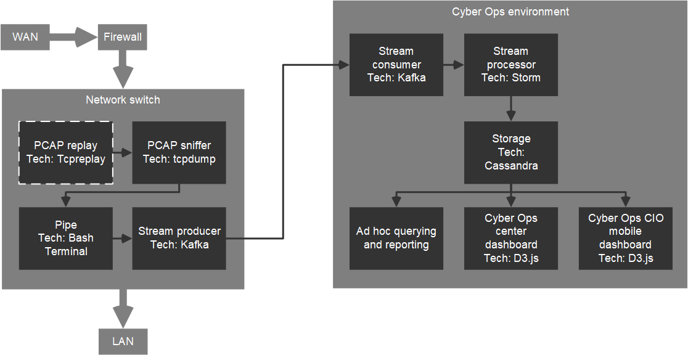

<!--
-->
# Streaming network packet processing

## Abstract
<!--
Relevancy to big data.
Network flow and the Vs,
including all the supporting data services,
beyond the network activity.
Data used is CICIDS2017 PCAP
-->

## Keywords:
- packet capture
- streaming data
- cyber security
- Apache Kafka
- Apache Storm
- Apache Cassandra

## Architecture


## Instance 1 setup
Instance 1 simulates the packet capture on the network switch.

- Platform: [Google Cloud Platform](https://console.cloud.google.com/compute/instances?project=user0112358d&instancessize=50)
(GCP)
- Name: instance-1
- Operating system: Debian
- vCPU: 1
- Memory: 3.75 GB

### Install tcpdump, tcpreplay, and Java JDK
Java is required for Kafka.
```
sudo apt-get update
sudo apt-get upgrade

sudo apt-get install tcpreplay
sudo apt-get install tcpdump
sudo apt install default-jdk
```

### Install and configure Kafka
Make Kafka user and give sudo privileges.
```
sudo useradd kafka -m
sudo passwd kafka
sudo adduser kafka sudo
```

Log into user and download and extract the Kafka binaries.
Check that the binary version exists at [downloads.apache.org/kafka](https://downloads.apache.org/kafka).
```
su -l kafka
mkdir ~/Downloads
curl "https://downloads.apache.org/kafka/2.5.0/kafka_2.13-2.5.0.tgz" -o ~/Downloads/kafka.tgz
mkdir ~/kafka
cd ~/kafka
tar -xvzf ~/Downloads/kafka.tgz --strip 1
```

Configure the Kafka server.
```
vim ~/kafka/config/server.properties
```

Add to end of file. Punch ```GG``` > ```A``` then type:
```
delete.topic.enable = true
```
Then ```esc``` > ```wq``` > ```enter```

Create the systemd unit files for zookeeper and Kafka.
Upload [zookeeper.service](templates/zookeeper.service)
and [kafka.service](templates/kafka.service) to the instance.
Copy to system directory.
```
sudo cp ../oberljn/zookeeper.service /etc/systemd/system/zookeeper.service
sudo cp ../oberljn/kafka.service /etc/systemd/system/kafka.service
```

This daemon reload may be necessary.
```
sudo systemctl daemon-reload
```

Start servers.
```
sudo systemctl start zookeeper
sudo systemctl start kafka
```

Check it's running.
```
sudo journalctl -u kafka
```

Enable Kafka on boot.
<!-- Should also enable zookeeper? -->
```
sudo systemctl enable kafka
```

## Instance 2 setup
Instance 2 represents the master packet processer
in the cyber ops environment.

Repeat Kafka install steps as in instance 1 setup.

## Kafka test
Make a topic and publish a heartbeat message.

Make topics.
```
~/kafka/bin/kafka-topics.sh --create --zookeeper localhost:2181 --replication-factor 1 --partitions 1 --topic exampleTopic
~/kafka/bin/kafka-topics.sh --create --zookeeper localhost:2181 --replication-factor 1 --partitions 1 --topic instance-1-heartbeat
```

List topics.
```
~/kafka/bin/kafka-topics.sh --list --bootstrap-server localhost:9092
```

Delete topics.
```
~/kafka/bin/kafka-topics.sh --zookeeper localhost:2181 --delete --topic exampleTopic
```

Publish a message.
```
echo "Hello, World" | ~/kafka/bin/kafka-console-producer.sh --broker-list localhost:9092 --topic instance-1-heartbeat > /dev/null
```

Consume the message in another session.
```
~/kafka/bin/kafka-console-consumer.sh --bootstrap-server localhost:9092 --topic instance-1-heartbeat --from-beginning
```

See [instance_1_heartbeat.py](templates/instance_1_heartbeat.py), which publishes a heartbeat.

## PCAP replay and capture
Network sniffers, like Wireshark.
To simulate the network activity and sniffer
on a network switch,
instance 1 replays a large PCAP file, simulating the network traffic
through the switch.
"The basic operation of tcpreplay is to resend all packets from
the input file(s) at the speed at which they were recorded,
or a specified data rate, up to as fast as the hardware is capable"
(AppNeta).
The PCAP stream will be published by
a Kafka topic.

In one session, listen to the interface.
```
sudo tcpdump -i eth0 -nn -s0 -v port 80
sudo tcpdump -i eth0 -nn -c 5
```

On session 1, filter to a known host.
```
sudo tcpdump -i eth0 -nn -v host 192.168.3.131
```

<!-- This is capturing the SSH traffic, so filter that out,
but that may filter out network SSH [?] -->

- ```-i``` the interface
- ```-nn``` to disable IP and port name resolution
- ```-c``` number of packets
- ```-l``` number of loops
- ```-K``` "This option loads the specified pcap(s) into RAM
before starting to send in order to improve replay performance
while introducing a startup performance hit."
- ```--pktlen``` "By specifying this option, tcpreplay will ignore
the snaplen field and instead try to send packets based
on the original packet length. Bad things may happen"
- ```--netmap``` "will detect netmap capable network drivers on Linux
and BSD systems. If detected, the network driver is bypassed for
the execution duration, and network buffers will be written to directly.
This will allow you to achieve full line rates on commodity network adapters,
similar to rates achieved by commercial"

On session 2, replay a PCAP at speed captured.
```
sudo tcpreplay -i eth0 -K --loop 1 smallFlows.pcap
```

Host 192.168.3.131 is known in smallFlows by:
```
sudo tcpdump -v -r smallFlows.pcap > smallFlows.txt
less smallFlows.txt
```

If tcpreplay is throwing errors that packets are too large,
increase the MTU setting.
"the maximum transmission unit (MTU) is the size of the largest
protocol data unit (PDU) that can be communicated in a
single network layer transaction.
The MTU relates to, but is not identical to the maximum frame size
that can be transported on the data link layer, e.g. Ethernet frame"
```
ip link list |grep eth0
sudo ip link set eth0 mtu 1500
```

## Replaying CICIDS2017 PCAP
<!-- CICIDS2017 PCAP file is 8.23 GB,
and takes forever to transfer to the VM.
How to do this more efficiently? -->

## Pipe capture to Kafka
It is suggested to pipe tshark (or tcpdump?) output
as JSON to netcat on a port, eg here 8888.
netcat listens on port x and data is piped to Kafka producer script.
```
session 1 > nc -l 8888 | ./producer.sh
session 2 > sudo tshark -l | nc 127.1 8888
```

Or use a named pipe:
```
session 1 > mkfifo tsharkpipe
session 1 > tail -f -c +0 tsharkpipe | producer.sh
session 2 > sudo tshark -l > tsharkpipe
```

## Consume Kafka topics from instance 1

## Packet analytics
The Storm cluster on HDFS consumes the Kafka PCAP topic
in order to parse, filter, reduce, analyze, and model packet capture.
<!-- Python's Scapy [?]
Or consider Spark Streaming socket input for RDD, instead of Storm
read up on Storm rolling window
-->

Packet extract namespace:
- number [?]
- time
- source
- destination
- protocol
- length
- flag

Create a file for parsing development and testing.
```
session 1 $ sudo tcpdump -i eth0 -nn -c 5 -vvvv > tmp.txt
session 2 $ sudo tcpreplay -i eth0 -tK --loop 3 smallFlows.pcap
```

See packet parse namespace and regular expressions at [packet_parse.json](packet_parse.json).
See Python packet parse code at [packet_parse.py](packet_parse.py)

## Storage
PCAP data and KPIs from Storm processes are
stored in a Cassandra database on Hadoop.
Cassandra has been chosen due to the need
for high availability in an environment like cyber ops.
Cassandra has multiple master nodes that can continue to run
the DB if one goes down <!--#cite-->.
Whereas MongoDB has one master node in a cluster that,
if it goes down, is not replaced until after 10 to 30 seconds <!--#cite-->.
During the replacement process, the cluster cannot
take input.

<!--
As data types must be defined in Cassandra, and MOngoDB is scheemaless,
PCAP variables should be known beforehand.
No need for scheemaless essentially.
Query language or CQL is very similar to SQL, so analysts should be
at ease with ad-hoc queries on Cassandra.
-->

## Ad hoc reporting
Cassandra's query language CQL.

## Cyber ops dashboard
D3.js <!--best for real-time?-->. Open source, web standards, mobile version

## References and resources
- Packet capture (pcap) is a performant C++ probe that captures network packets and
streams them into Kafka. A pcap Storm topology then streams them into Cloudera
Cybersecurity Platform (CCP)
https://docs.cloudera.com/ccp/2.0.1/add-new-telemetry-data-source/topics/ccp-pcap.html
- Stream Processing vs. Continuous PCAP: The Big Shift in
https://www.extrahop.com/company/blog/2016/stream-processing-vs-continuous-pcap-the-big-shift-in-network-monitoring-architectures/
- Radford. Network Traffic Anomaly Detection Using Recurrent Neural Networks.
28 Mar 2018.
url: https://arxiv.org/pdf/1803.10769.pdf
- Intrusion Detection Evaluation Dataset (CICIDS2017).
University of New Brunswick: Canadian Institute for Cybersecurity.
url: https://www.unb.ca/cic/datasets/ids-2017.html
- Iman Sharafaldin, Arash Habibi Lashkari, and Ali A. Ghorbani.
"Toward Generating a New Intrusion Detection Dataset and Intrusion Traffic Characterization".
4th International Conference on Information Systems Security and Privacy (ICISSP),
Portugal, January 2018.
- https://www.digitalocean.com/community/tutorials/how-to-install-apache-kafka-on-debian-9
- https://cloudwafer.com/blog/installing-apache-kafka-on-debian-9/
- Python kafka
- https://opensource.com/article/18/10/introduction-tcpdump
- AppNeta http://tcpreplay.appneta.com/wiki/tcpreplay-man.html
- ref: Protocol Numbers
https://www.iana.org/assignments/protocol-numbers/protocol-numbers.xhtml
- ref: Description of the Internet Protocol, IP
https://www.eit.lth.se/ppplab/IPHeader.htm
- ref: pcaptools
https://github.com/caesar0301/awesome-pcaptools
- https://alvinalexander.com/linux-unix/linux-processor-cpu-memory-information-commands/
- smallFlows.pcap
https://tcpreplay.appneta.com/wiki/captures.html
- Datasets http://205.174.165.80/CICDataset/CIC-IDS-2017/Dataset/
GeneratedLabelledFlows.zip
This is already processed PCAPs and its resolution is only minutes.
- http://205.174.165.80/CICDataset/CIC-IDS-2017/Dataset/PCAPs/
Friday-WorkingHours.pcap (http://205.174.165.80/CICDataset/CIC-IDS-2017/Dataset/PCAPs/Friday-WorkingHours.pcap)
- Protocol numbers
https://www.iana.org/assignments/protocol-numbers/protocol-numbers.xml

## Useful snippets
System info.
```
top
cat /proc/cpuinfo
cat /proc/meminfo
free -m
```

Interface info.
```
ip link show
```
