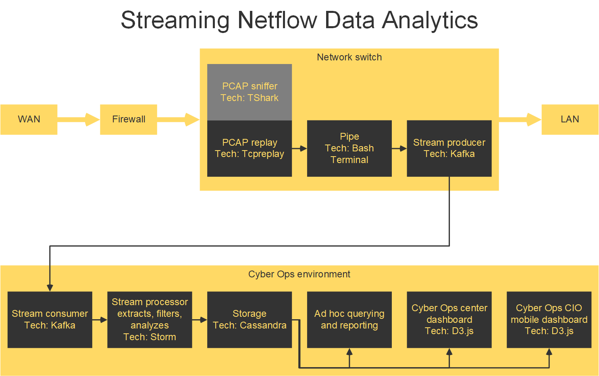

<!--
-->
# Streaming PCAP
Real-time PCAP / netflow procesing / analytics for cybersecurity

## Abstract
<!--
Relevancy to big data.
Network flow and the Vs,
including all the supporting data services,
beyond the network activity.
-->

## Keywords:
- security
- streaming data
- packet capture
- netflow
- Apache Kafka
- Apache Storm

## Architecture


## Spin up and configuration
[Google Cloud Platform](https://console.cloud.google.com/compute/instances?project=user0112358d&instancessize=50)

### instance-1
Compute Engine VM instance

```
sudo apt-get updat
sudo apt-get install tcpreplay
sudo apt-get install tcpdump
```


## PCAP replay
Network sniffers, like Wireshark.
To simulate the network activity and sniffer
on a network switch,
a large PCAP file is replayed on a cloud server A.
The PCAP stream is consumed and published by
a Kafka topic.

```
ip link show
```

On second terminal, listen to interface.
```
sudo tcpdump -i eth0 -nn -s0 -v port 80

sudo tcpdump -i eth0 -nn -c 5
```
-i the interface
-nn to diable IP and port name resolution
-c number of packets
This is capturing the SSH traffic, so filter that out,
but that may filter out network SSH [?], or rather send
replay to a particular port, and listen on said port?

Ref: https://opensource.com/article/18/10/introduction-tcpdump


Suggested to pipe tshark output as JSON to netcat on port x.
netcat listens on port x and data is piped to Kafka producer script.
```
shell1> nc -l 8888 | ./producer.sh
shell2> sudo tshark -l | nc 127.1 8888
```
tshark -l deals with buffering

Or use a named pipe
```
shell1> mkfifo tsharkpipe
shell1> tail -f -c +0 tsharkpipe | producer.sh
shell2> sudo tshark -l > tsharkpipe
```

Or consider what tcpbridge does.
https://tcpreplay.appneta.com/wiki/tcpbridge-man.html

Cloud server B consumes the Kafka topic.

## PCAP analytics
The Storm cluster on HDFS consumes the Kafka PCAP topic
in order to extract, filter, reduce, analyze, and model.
Python's Scapy [?]

Namespace:
- number [?]
- time
- source
- destination
- protocol
- length
- flag

ref: Protocol Numbers
https://www.iana.org/assignments/protocol-numbers/protocol-numbers.xhtml

ref: Description of the Internet Protocol, IP
https://www.eit.lth.se/ppplab/IPHeader.htm

```

# For testing packets captured like:
# sudo tcpdump -i eth0 -nn -c 5 -vvv > tmp.txt

with open('tmp.txt', 'r') as f:
    pcap = f.read()
    pcap = pcap.replace('\n    ', ' ') # In triple verbose, newline made
    pcap = pcap.split('\n')[:-1]

time_pat = re.compile('^(\d{2}:\d{2}:\d{2}.\d+)\s')
src_pat = re.compile('\s([\d\.]+)\s>')
dst_pat = re.compile('>\s([\d\.]+):')
flags_pat = re.compile('Flags \[([^\]]+)\]')
ip_pat = re.compile('^\d{2}:\d{2}:\d{2}.\d+\s([^\s]+)\s')
proto_pat = re.compile('proto[^\(]+\((\d{1,3})\)')

#ttl_pat = re.compile('ttl (\d+),')

fields = (
  {
  name:    'time'
  re_pat:  '^(\d{2}:\d{2}:\d{2}.\d+)\s'}

  src:
    pat: src_pat
  }
)

class Packet(object):
    def __init__(self, fields):
        pass

need to install pip3 on isntance-1 #here

time = time_pat.search(packet).group(1)
src = source_pat.search(pcap[0]).group(1)
dst = dst_pat.search(pcap[0]).group(1)
flags = flag_pat.search(pcap[0]).group(1)
ip = ip_pat.search(pcap[0]).group(1)
ttl = ttl_pat.search(pcap[0]).group(1)
proto = proto_pat.search(pcap[0]).group(1)

try: #code
except Exception as e: log_error(e, field, packet)

```

<!-- Or consider Spark Streaming socket input for RDD -->

<!--
rolling window
-->

## Storage
PCAP data and KPIs from Storm processes are
stored in a Cassandra database on Hadoop.

## Ad hoc reporting
Cassandra's query language CQL.

## Cyber ops dashboard
D3.js [best for realtime?]. Open source, web standards,, mobile version

### Database <!--and querying-->
MongoDB or Cassandra [?choose].

Cassandra has been chosen due to the need
for high availability in an environment like cyber ops.
Cassandra has multiple master nodes that can continue to run
the DB if one goes down #cite.
Whereas MongoDB has one master node in a cluster that,
if it goes down, is not replaced until after 10 to 30 seconds #cite.
During the replacement process, the cluster cannot
take input.

<!--
As data types must be defined in Cassandra, and MOngoDB is scheemaless,
PCAP variables should be known beforehand.
No need for scheemaless essentially.
Query language or CQL is very similar to SQL, so analysts should be
at ease with ad-hoc queries on Cassandra.
-->


<!--
Datasets

http://205.174.165.80/CICDataset/CIC-IDS-2017/Dataset/
> GeneratedLabelledFlows.zip
This is already processed PCAPs and its resolution is only minutes.

http://205.174.165.80/CICDataset/CIC-IDS-2017/Dataset/PCAPs/
> Friday-WorkingHours.pcap

http://205.174.165.80/CICDataset/CIC-IDS-2017/Dataset/PCAPs/Friday-WorkingHours.pcap


Protocol numbers
https://www.iana.org/assignments/protocol-numbers/protocol-numbers.xml

-->

## See
- Packet capture (pcap) is a performant C++ probe that captures network packets and
streams them into Kafka. A pcap Storm topology then streams them into Cloudera
Cybersecurity Platform (CCP)
https://docs.cloudera.com/ccp/2.0.1/add-new-telemetry-data-source/topics/ccp-pcap.html
- Stream Processing vs. Continuous PCAP: The Big Shift in
https://www.extrahop.com/company/blog/2016/stream-processing-vs-continuous-pcap-the-big-shift-in-network-monitoring-architectures/

## References
- Radford. Network Traffic Anomaly Detection Using Recurrent Neural Networks.
28 Mar 2018.
url: https://arxiv.org/pdf/1803.10769.pdf
- Intrusion Detection Evaluation Dataset (CICIDS2017).
University of New Brunswick: Canadian Institute for Cybersecurity.
url: https://www.unb.ca/cic/datasets/ids-2017.html
- Iman Sharafaldin, Arash Habibi Lashkari, and Ali A. Ghorbani.
"Toward Generating a New Intrusion Detection Dataset and Intrusion Traffic Characterization".
4th International Conference on Information Systems Security and Privacy (ICISSP),
Portugal, January 2018.
